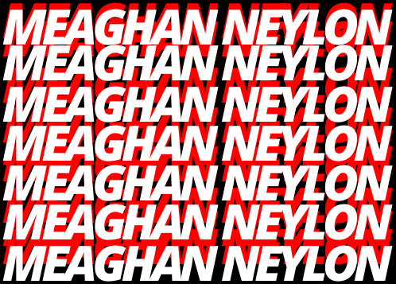
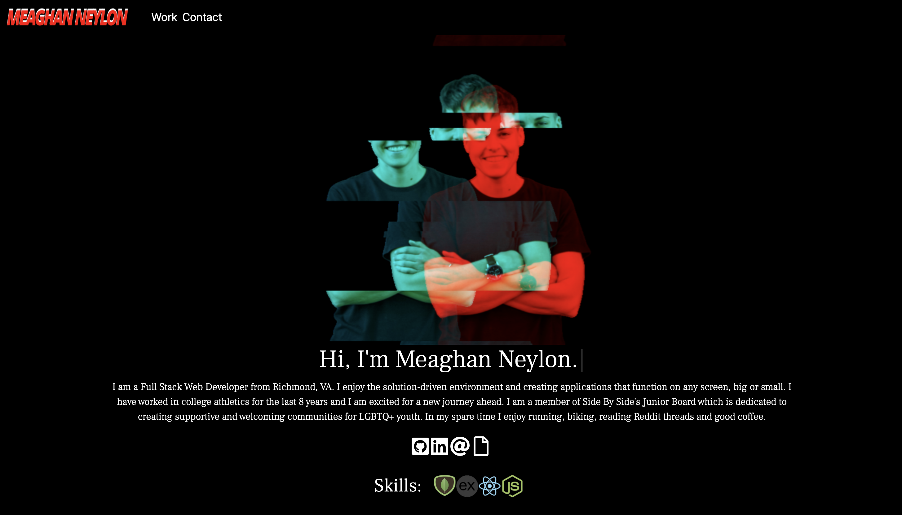

<p align="center">

</p>
Portfolio to market my work, contact information and information about myself using React.

### Deployed Link

Deployed link can be found here: https://www.meaghanneylon.com

## Table of Contents

- [Usage](#usage)
- [Technology](#technology)
- [License](#license)
- [Contributing](#contributing)
- [Tests](#tests)
- [Questions](#questions)

## Usage

Copy and paste link to the deployed application in browser:

```
https://https://www.meaghanneylon.com
```



## Technology

### APIs and Libraries

- Bootstrap
- React
- React Router
- Font Awesome

## License

[](https://opensource.org/licenses/MIT)

## Contributing

N/A

## Tests

N/A

## Questions

- GitHub: [neylonmc](https://github.com/neylonmc)
- Email: [neylonmc@gmail.com](mailto:neylonmc@gmail.com)
